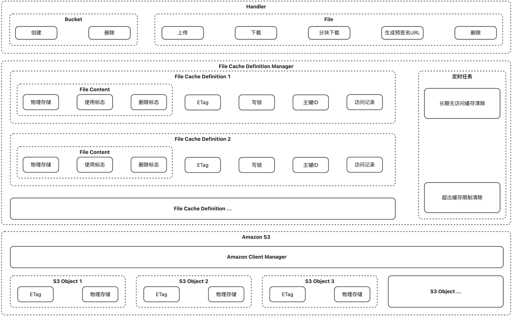

在线文档：https://catalpawoo.gitbook.io/buaoye-oss

---
# 📖 简介
<b>Buaoye Oss</b> 是一个基于 Amazon S3 的对象存储操作工具，旨在降低开发者的使用门槛、提升整体编码效率。

在 Amazon S3 的基础上二次封装实现了以下功能：

- 客户端连接管理
- 基础 OSS 操作：创建 / 删除桶、上传 / 下载文件等
- 文件缓存管理

> 为什么是 <b>Buaoye（不熬夜）</b>：
>  作者的愿景是所有的开发者都能够不用在循环往复的业务 CRUD 工作下加班、熬夜，所以将自己已经实现的一些二次封装代码开源以降低大家的学习成本、提高效率，也提供一些解决方案的实现灵感。
>  能力一般，水平有限。如有谬误之处，烦请各位批评指正。

# 🔧 架构设计
